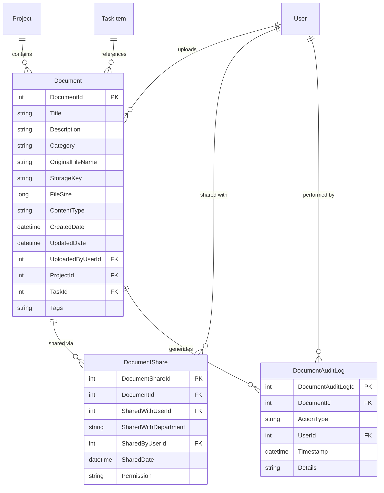

# Data Model: Document Upload and Management

**Feature**: `001-document-management`  
**Date**: 2026-09-23  
**Status**: Completed  

---

## Entity Relationships

---

## Entities Specification

### 1. `Document`

Represents an uploaded document with associated metadata and storage pointers.

| Column | Type | Nullable | Description / Validation |
|---|---|---|---|
| `DocumentId` | `int` | No (PK) | Auto-incrementing primary key. |
| `Title` | `nvarchar(200)` | No | Display title provided by user. Max 200 chars. |
| `Description` | `nvarchar(1000)` | Yes | Optional descriptive notes. Max 1000 chars. |
| `Category` | `nvarchar(50)` | No | Predefined values: *Project Documents*, *Team Resources*, *Personal Files*, *Reports*, *Presentations*, *Other*. |
| `OriginalFileName` | `nvarchar(260)` | No | Original client filename for user downloads. |
| `StorageKey` | `nvarchar(500)` | No | Unique sanitized relative storage path (e.g., `1/personal/a1b2c3d4-....pdf`). |
| `FileSize` | `bigint` | No | Size in bytes (max 26,214,400 bytes = 25 MB). |
| `ContentType` | `nvarchar(255)` | No | MIME type (e.g., `application/pdf`, `image/png`). Whitelisted types only. |
| `CreatedDate` | `datetime2` | No | Timestamp of upload (UTC). |
| `UpdatedDate` | `datetime2` | No | Timestamp of last metadata edit or file replacement (UTC). |
| `UploadedByUserId` | `int` | No (FK) | Reference to `User.UserId`. |
| `ProjectId` | `int` | Yes (FK) | Optional reference to `Project.ProjectId`. |
| `TaskId` | `int` | Yes (FK) | Optional reference to `TaskItem.TaskId`. Set to `null` if task reference is detached. |
| `Tags` | `nvarchar(500)` | Yes | Comma-separated search tags (e.g., "q3, financial, budget"). |

**Navigation Properties**:
- `UploadedByUser` (`User`)
- `Project` (`Project?`)
- `Task` (`TaskItem?`)
- `Shares` (`ICollection<DocumentShare>`)
- `AuditLogs` (`ICollection<DocumentAuditLog>`)

---

### 2. `DocumentShare`

Tracks direct user or department sharing permissions.

| Column | Type | Nullable | Description / Validation |
|---|---|---|---|
| `DocumentShareId` | `int` | No (PK) | Auto-incrementing primary key. |
| `DocumentId` | `int` | No (FK) | Reference to `Document.DocumentId` (Cascade delete on document deletion). |
| `SharedWithUserId` | `int` | Yes (FK) | Specific recipient user. Null if sharing by department. |
| `SharedWithDepartment` | `nvarchar(100)` | Yes | Target department name. Null if sharing by specific user. |
| `SharedByUserId` | `int` | No (FK) | Reference to grantor `User.UserId`. |
| `SharedDate` | `datetime2` | No | Timestamp of share action (UTC). |
| `Permission` | `nvarchar(20)` | No | Default: `"ReadOnly"`. |

---

### 3. `DocumentAuditLog`

Immutable record of document lifecycle operations.

| Column | Type | Nullable | Description / Validation |
|---|---|---|---|
| `DocumentAuditLogId` | `int` | No (PK) | Auto-incrementing primary key. |
| `DocumentId` | `int` | Yes | Reference to document (retained even if document is later deleted). |
| `ActionType` | `nvarchar(50)` | No | Actions: `Upload`, `Download`, `Preview`, `EditMetadata`, `ReplaceFile`, `Share`, `Delete`. |
| `UserId` | `int` | No (FK) | User who executed the action. |
| `Timestamp` | `datetime2` | No | Timestamp of occurrence (UTC). |
| `Details` | `nvarchar(1000)` | Yes | Details such as filename, target recipient, or updated fields. |

---

## State Transitions & Lifecycle Rules

1. **Upload**: User selects file → Validation passes → File written to storage → Record created with `CreatedDate = UtcNow`.
2. **Edit Metadata**: User updates Title/Description/Category/Tags → Record updated with `UpdatedDate = UtcNow` → Audit log entry `EditMetadata` created.
3. **Replace File**: User uploads new file for existing document → Validation passes → New file saved to storage → Old file purged → FileSize, ContentType, and `UpdatedDate` updated → Audit log entry `ReplaceFile` created.
4. **Task Detachment**: Associated task is deleted or document is detached → `TaskId` set to `null` → Document remains accessible in project/personal views.
5. **Deletion**:
   - Check if attached to active tasks → Display confirmation prompt with task list.
   - Upon confirmation: Remove `TaskId` reference, remove physical file via `IFileStorageService.DeleteAsync`, delete `DocumentShare` records, remove `Document` record, and write `Delete` entry to `DocumentAuditLog`.
