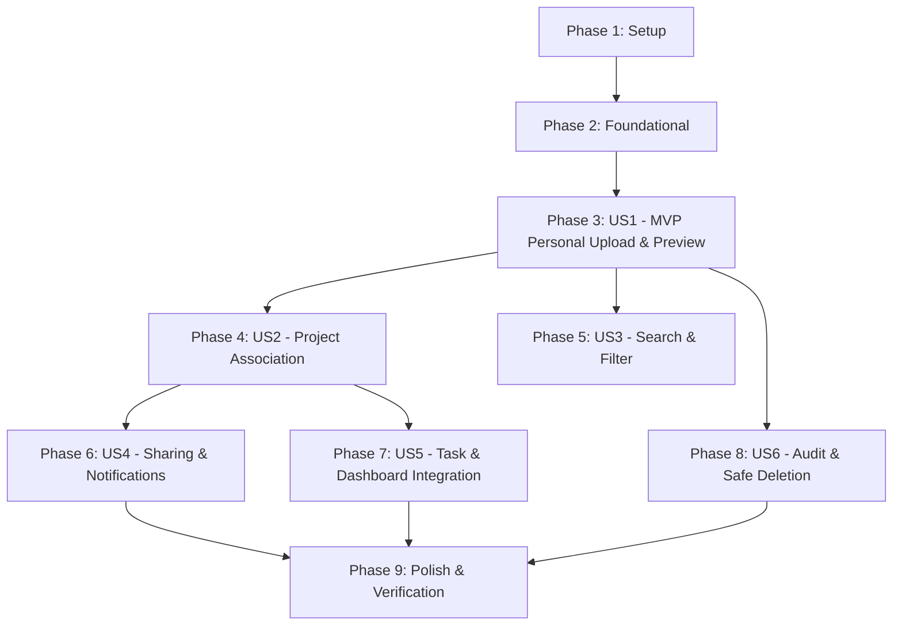

# Tasks: Document Upload and Management

**Feature**: `001-document-management`  
**Input**: Design artifacts from `specs/001-document-management/` (`spec.md`, `plan.md`, `data-model.md`, `contracts/`, `research.md`, `quickstart.md`)  
**Status**: Ready for Implementation  

---

## Phase 1: Setup (Shared Infrastructure)

**Purpose**: Project preparation, directories, and configuration

- [X] T001 Ensure local file storage directory `ContosoDashboard/AppData/uploads` is created and ignored in `.gitignore`
- [X] T002 [P] Configure storage path settings and MIME whitelist definitions in `ContosoDashboard/appsettings.json`

---

## Phase 2: Foundational (Blocking Prerequisites)

**Purpose**: Core data models, database context integration, and storage abstraction service

**⚠️ CRITICAL**: Must be completed before user stories can be implemented.

- [X] T003 [P] Create `Document` entity in `ContosoDashboard/Models/Document.cs`
- [X] T004 [P] Create `DocumentShare` entity in `ContosoDashboard/Models/DocumentShare.cs`
- [X] T005 [P] Create `DocumentAuditLog` entity in `ContosoDashboard/Models/DocumentAuditLog.cs`
- [X] T006 [P] Create view models (`DocumentUploadModel`, `DocumentEditModel`, `DocumentSummaryStats`) in `ContosoDashboard/Models/DocumentViewModels.cs`
- [X] T007 Register `DbSet<Document>`, `DbSet<DocumentShare>`, `DbSet<DocumentAuditLog>` and entity relationships in `ContosoDashboard/Data/ApplicationDbContext.cs`
- [X] T008 [P] Define storage interface `IFileStorageService` in `ContosoDashboard/Services/IFileStorageService.cs`
- [X] T009 Implement `LocalFileStorageService` in `ContosoDashboard/Services/LocalFileStorageService.cs` (handling file writing outside `wwwroot`, atomic purge on error, GUID paths)
- [X] T010 [P] Define `IDocumentService` interface in `ContosoDashboard/Services/IDocumentService.cs` per service contract
- [X] T011 Register `IFileStorageService`, `IDocumentService`, and map MVC controllers in `ContosoDashboard/Program.cs`

**Checkpoint**: Foundation ready — database entities and storage abstractions ready for user story implementation.

---

## Phase 3: User Story 1 - Secure Document Upload and Personal File Management (Priority: P1) 🎯 MVP

**Goal**: Enable employees to upload documents (< 25 MB, whitelisted extensions), view their personal documents list, preview PDFs/images in-browser, and download files with original filenames.

**Independent Test**: Login as Ni Kang, navigate to `/documents`, upload a valid PDF, verify it appears in "My Documents", preview it in the browser modal, and download it.

- [X] T012 [US1] Implement core upload and personal retrieval logic with IDOR validation in `ContosoDashboard/Services/DocumentService.cs`
- [X] T013 [US1] Implement download and in-browser streaming endpoint (`GET /api/documents/{id}/stream` and `/download`) with IDOR checks in `ContosoDashboard/Controllers/DocumentsController.cs`
- [X] T014 [P] [US1] Create in-browser preview modal component `ContosoDashboard/Pages/DocumentPreviewModal.razor` supporting PDF and image rendering
- [X] T015 [US1] Create main document management page `ContosoDashboard/Pages/Documents.razor` with "My Documents" tab, upload dialog, progress indicator, and validation
- [X] T016 [US1] Add "Documents" link to main navigation in `ContosoDashboard/Shared/NavMenu.razor`

**Checkpoint**: User Story 1 (MVP) is fully functional and testable independently.

---

## Phase 4: User Story 2 - Project Association and Team Document Access (Priority: P2)

**Goal**: Allow linking documents to projects during upload, enabling all project team members to browse and download shared project documents while enforcing IDOR protection against non-members.

**Independent Test**: Upload a document associated with a project as Ni Kang. Login as Floris Kregel (project member) and verify access. Login as an unauthorized user and verify access is denied.

- [X] T017 [US2] Implement project document query methods and project membership authorization checks in `ContosoDashboard/Services/DocumentService.cs`
- [X] T018 [US2] Add project selector to upload modal and implement "Project Documents" tab in `ContosoDashboard/Pages/Documents.razor`
- [X] T019 [US2] Add Documents sub-section/tab to project overview in `ContosoDashboard/Pages/ProjectDetails.razor`

**Checkpoint**: User Story 2 complete — project documents are isolated and shared strictly among project members.

---

## Phase 5: User Story 3 - Search, Sorting, Filtering, and Metadata Management (Priority: P3)

**Goal**: Enable full search across document titles, descriptions, and tags; category and date filtering; column sorting; and editing metadata or replacing file content.

**Independent Test**: Search by tag, filter by category, sort by date descending, edit a document's title/category, and verify duplicate-title advisory notifications.

- [X] T020 [US3] Implement search, filter, sort, metadata update, and file replacement methods in `ContosoDashboard/Services/DocumentService.cs`
- [X] T021 [US3] Add search bar, category dropdown filter, and sort headers to `ContosoDashboard/Pages/Documents.razor`
- [X] T022 [US3] Create metadata edit and file replacement dialogs in `ContosoDashboard/Pages/Documents.razor` with duplicate title advisory notice

**Checkpoint**: User Story 3 complete — document library is easily searchable and maintainable.

---

## Phase 6: User Story 4 - Document Sharing and Notification Workflows (Priority: P4)

**Goal**: Allow document owners to share files with individual users or departments (with dynamic evaluation), generating in-app notifications for recipients and project collaborators.

**Independent Test**: Share a personal document with a colleague, verify they receive a notification and see it in "Shared with Me" with read-only access. Verify project uploads notify all project members except the uploader.

- [X] T023 [US4] Implement user/department sharing logic and dynamic department claim evaluation in `ContosoDashboard/Services/DocumentService.cs`
- [X] T024 [US4] Integrate project and share notifications using `INotificationService` in `ContosoDashboard/Services/DocumentService.cs` (excluding the uploader per clarification)
- [X] T025 [US4] Implement "Shared with Me" tab and "Share Document" modal dialog in `ContosoDashboard/Pages/Documents.razor`

**Checkpoint**: User Story 4 complete — cross-functional document sharing and alerts functioning seamlessly.

---

## Phase 7: User Story 5 - Task Integration and Dashboard Overview (Priority: P5)

**Goal**: Enable attaching documents to tasks, auto-associating with the task's parent project, and showing recent documents widget and summary count card on the main dashboard home page.

**Independent Test**: Open a task, attach a document, verify linkage. Open home dashboard (`/`), verify "Recent Documents" widget displays 5 recent items and metric card displays total accessible count.

- [X] T026 [US5] Implement task attachment and detachment methods in `ContosoDashboard/Services/DocumentService.cs`
- [X] T027 [US5] Add document attachment section and upload button to task details in `ContosoDashboard/Pages/Tasks.razor`
- [X] T028 [P] [US5] Create dashboard widget component `ContosoDashboard/Shared/RecentDocumentsWidget.razor`
- [X] T029 [US5] Integrate `RecentDocumentsWidget` and document count summary metric card into `ContosoDashboard/Pages/Index.razor`

**Checkpoint**: User Story 5 complete — document management deeply integrated into daily task and dashboard workflows.

---

## Phase 8: User Story 6 - Administrative Audit, Compliance, and Lifecycle Deletion (Priority: P6)

**Goal**: Enforce permanent audit trail logging, provide audit report views for administrators, and handle document deletion with task detachment warning and cascade cleanup.

**Independent Test**: Delete a document referenced by a task, verify confirmation modal displays attached tasks, confirm deletion, verify file and task reference are cleaned up and audit record is preserved.

- [X] T030 [US6] Implement audit logging for all operations and audit log retrieval in `ContosoDashboard/Services/DocumentService.cs`
- [X] T031 [US6] Implement safe deletion with active task detachment warning prompt in `ContosoDashboard/Services/DocumentService.cs` and `ContosoDashboard/Pages/Documents.razor`
- [X] T032 [US6] Implement Administrator-only "Audit Logs & Compliance" tab with action filters in `ContosoDashboard/Pages/Documents.razor`

**Checkpoint**: User Story 6 complete — enterprise compliance, audit logging, and safe lifecycle operations fully operational.

---

## Phase 9: Polish & Cross-Cutting Concerns

**Purpose**: Verification, seeding, and quickstart scenario testing

- [X] T033 Add sample seed documents and categories in `ContosoDashboard/Data/DbInitializer.cs`
- [X] T034 Run end-to-end validation scenarios per `specs/001-document-management/quickstart.md`
- [X] T035 Execute full build verification (`dotnet build`) ensuring zero errors and zero warnings

---

## Dependencies & Execution Order

---

## Implementation Strategy: MVP First

1. **Foundational & Setup (Phases 1 & 2)**: Establish entities, storage service, and DbContext wiring.
2. **MVP Milestone (Phase 3 - User Story 1)**: Deliver personal file upload, storage, listing, in-browser preview, and download.
3. **Incremental Enhancement (Phases 4 through 8)**: Incrementally roll out project sharing, search/filter, notifications, task attachments, and audit trail without breaking earlier functionality.
4. **Validation (Phase 9)**: Verify against all quickstart scenarios and ensure clean build.
