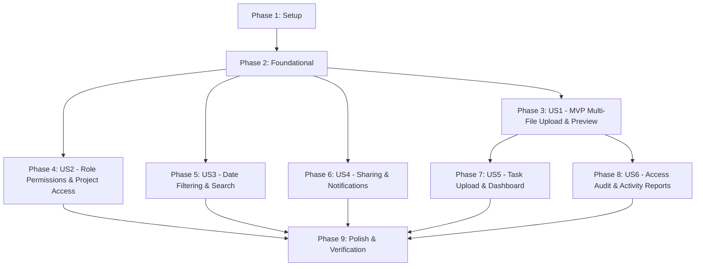

# Tasks: Document Management Gap Closure

**Feature**: `001-document-management`  
**Input**: Design documents from `specs/001-document-management/` (`spec.md`, `plan.md`, `data-model.md`, `contracts/`, `research.md`, `quickstart.md`)  
**Prerequisites**: `plan.md`, `spec.md`, `research.md`, `data-model.md`, `contracts/`, `constitution.md`  
**Status**: Ready for Implementation  

## Format: `[ID] [P?] [Story] Description with file path`

- **[P]**: Can run in parallel (different files, no dependencies)
- **[Story]**: Which user story this task belongs to (e.g., [US1], [US2], [US3]...)
- Include exact file paths in all task descriptions

---

## Phase 1: Setup (Shared Infrastructure)

**Purpose**: Configuration verification, test harness initialization, and storage preparation for gap-closure execution

- [X] T001 Verify and ensure local upload storage directory `ContosoDashboard/AppData/uploads` is created and ignored in repository root `.gitignore`
- [X] T002 [P] Configure 25 MB max request size, form file buffering, and MIME whitelist definitions in `ContosoDashboard/appsettings.json` and `ContosoDashboard/Program.cs`
- [X] T003 [P] Initialize test project `ContosoDashboard.Tests` targeting `net8.0` with xUnit, `Microsoft.NET.Test.Sdk`, and EF Core In-Memory / SQLite packages referencing `ContosoDashboard`

---

## Phase 2: Foundational (Blocking Prerequisites)

**Purpose**: Core DTO models, test fixture scaffolding, and service interface contracts required across all user stories

**⚠️ CRITICAL**: Must be completed before user story implementation begins

- [X] T004 [P] Add `DocumentUploadResult`, `DocumentActivityReport`, `UploaderActivityStat`, and `ActivityPeriodStat` DTOs in `ContosoDashboard/Models/DocumentViewModels.cs`
- [X] T005 [P] Update `IDocumentService` interface with `UploadDocumentsAsync`, `UploadTaskDocumentAsync`, date-range `SearchDocumentsAsync`, `RecordDocumentAccessAsync`, `GetDocumentActivityReportAsync`, and `CheckDuplicateTitleAsync` signatures in `ContosoDashboard/Services/IDocumentService.cs`
- [X] T006 [P] Create test fixture and in-memory DbContext factory for service tests in `ContosoDashboard.Tests/TestDbContextFactory.cs`

**Checkpoint**: Foundation ready — test infrastructure, models, and service contracts defined; user story implementation can proceed.

---

## Phase 3: User Story 1 - Secure Document Upload and Personal File Management (Priority: P1) 🎯 MVP

**Goal**: Support multi-file upload with per-file outcomes (`DocumentUploadResult`), independent progress and error reporting, partial success retention, 25 MB limit and dual extension/MIME whitelist enforcement per file, along with single-file upload, personal document listing, and browser preview/download.

**Independent Test**: Run automated upload tests and manually navigate to `/documents` to upload a batch containing two valid files (PDF/image) and one invalid/oversized file. Verify independent progress and per-file outcomes: valid files are committed to disk/DB with status badge "Completado", invalid files display badge "Error: [Detalle]" without rolling back valid files, and in-browser preview/download works.

### Tests for User Story 1 ⚠️

- [X] T007 [P] [US1] Write automated tests for multi-file batch upload, 25 MB size limit, MIME/extension whitelist, and atomic failure isolation in `ContosoDashboard.Tests/Services/DocumentUploadTests.cs` (FR-001, FR-002, FR-003, FR-007, FR-025, SC-009)

### Implementation for User Story 1

- [X] T008 [US1] Implement dual extension and MIME-type validation in `ContosoDashboard/Services/DocumentService.cs` rejecting mismatched or unlisted files before disk write (FR-002, FR-003)
- [X] T009 [US1] Implement `UploadDocumentsAsync(IReadOnlyList<DocumentUploadModel> files, int requestingUserId)` in `ContosoDashboard/Services/DocumentService.cs` returning per-file `DocumentUploadResult` list with atomic file/DB persistence and independent error handling (FR-001, FR-006, FR-007, FR-025)
- [X] T010 [US1] Update upload modal in `ContosoDashboard/Pages/Documents.razor` to support `InputFile multiple` with explicit per-file status badges (Pendiente, Subiendo..., Completado, Error: [Detalle]) and independent outcomes display (FR-001, FR-004, FR-008, SC-004)
- [X] T011 [US1] Update preview modal in `ContosoDashboard/Pages/DocumentPreviewModal.razor` and download triggers in `ContosoDashboard/Pages/Documents.razor` to stream PDFs/images inline or download with original filename (FR-013, FR-014)

**Checkpoint**: User Story 1 (MVP) is fully functional and testable independently with passing automated tests.

---

## Phase 4: User Story 2 - Project Association and Team Document Access (Priority: P2)

**Goal**: Allow linking documents to projects during upload, enabling all project team members to browse and download shared project documents, while enforcing role-based mutation boundaries: Team Leads can view/download department documents but cannot edit, replace, or delete another user's document unless they are Administrator, document owner, or responsible Project Manager.

**Independent Test**: Run automated authorization tests. Log in as a Team Lead, view and download a document uploaded by a department member. Confirm that edit and delete buttons are completely hidden in the UI and rejected with `UnauthorizedAccessException` at the service layer. Log in as Project Manager and verify full management rights over project documents.

### Tests for User Story 2 ⚠️

- [X] T012 [P] [US2] Write automated tests verifying Team Lead read-only department permissions, PM project document management, and IDOR rejection for non-members in `ContosoDashboard.Tests/Services/DocumentAuthorizationTests.cs` (FR-011, FR-021, FR-022, SC-005)

### Implementation for User Story 2

- [X] T013 [US2] Enforce service-level mutation authorization in `UpdateDocumentMetadataAsync`, `ReplaceDocumentFileAsync`, and `DeleteDocumentAsync` in `ContosoDashboard/Services/DocumentService.cs` strictly restricting mutations to owner, Administrator, or responsible Project Manager, and restricting Team Leads to read/download access (FR-021, FR-022)
- [X] T014 [US2] Update project documents table in `ContosoDashboard/Pages/Documents.razor` to hide Edit and Delete action buttons for users without mutation rights (Team Leads over other users' files, regular members, shared recipients) (FR-011, FR-021)
- [X] T015 [US2] Add project selector dropdown in upload modal in `ContosoDashboard/Pages/Documents.razor` filtering to only active projects where the user is member, PM, or Admin (FR-005, FR-011)

**Checkpoint**: User Story 2 complete — project documents are isolated and shared strictly among project members with precise role boundaries.

---

## Phase 5: User Story 3 - Search, Sorting, Filtering, and Metadata Management (Priority: P3)

**Goal**: Enable full search across document titles, descriptions, tags, uploader names, and project names; column sorting (title, date, category, size); category and inclusive UTC calendar-date filtering; and duplicate title advisory notices.

**Independent Test**: Run automated search/filter tests. In the UI, apply start and end date filters on the documents list; verify that documents created within the inclusive UTC date boundary appear while outside documents are excluded. Enter a start date after end date and verify validation warning. Test sorting by clicking column headers. Upload a document with an existing title in the same category/project and verify advisory alert.

### Tests for User Story 3 ⚠️

- [X] T016 [P] [US3] Write automated tests for inclusive UTC calendar-date range filtering, column sorting, search query across author/project names, and duplicate title detection in `ContosoDashboard.Tests/Services/DocumentSearchFilterTests.cs` (FR-004, FR-009, FR-010, FR-012, FR-015)

### Implementation for User Story 3

- [X] T017 [US3] Implement `SearchDocumentsAsync` overload with `DateOnly? startDateUtc, DateOnly? endDateUtc` in `ContosoDashboard/Services/DocumentService.cs` applying inclusive UTC boundaries and expanding search to `UploadedByUser.DisplayName` and `Project.Name` (FR-010, FR-012)
- [X] T018 [US3] Implement sorting logic in `ContosoDashboard/Services/DocumentService.cs` and clickable column headers (Título, Fecha, Categoría, Tamaño) with sort direction arrows in `ContosoDashboard/Pages/Documents.razor` (FR-009)
- [X] T019 [US3] Add inclusive start and end date picker controls to filter toolbar in `ContosoDashboard/Pages/Documents.razor` with validation message rejecting start date greater than end date (FR-010)
- [X] T020 [US3] Implement `CheckDuplicateTitleAsync` in `ContosoDashboard/Services/DocumentService.cs` and advisory warning modal in `ContosoDashboard/Pages/Documents.razor` offering choice to save as new record or replace existing file (FR-004, FR-015)

**Checkpoint**: User Story 3 complete — document library is easily searchable, sortable, and filterable by date, category, and keyword.

---

## Phase 6: User Story 4 - Document Sharing and Notification Workflows (Priority: P4)

**Goal**: Allow document owners to share files with individual users or departments (with dynamic evaluation), generating in-app notifications for recipients and project collaborators (excluding the author/uploader).

**Independent Test**: Run automated sharing tests. Share a personal document with a user; confirm recipient gets in-app notification and sees file in "Shared with Me" in read-only mode (no edit/replace/delete buttons). Upload a document to a project; confirm all other active project members receive notification while uploader does not.

### Tests for User Story 4 ⚠️

- [X] T021 [P] [US4] Write automated tests for dynamic department claims evaluation and author exclusion in project notifications in `ContosoDashboard.Tests/Services/DocumentSharingTests.cs` (FR-017, FR-018)

### Implementation for User Story 4

- [X] T022 [US4] Update project upload notification logic in `ContosoDashboard/Services/DocumentService.cs` to notify all active project members and managers while explicitly excluding the uploading author (FR-018)
- [X] T023 [US4] Enforce read-only UI in "Shared with Me" tab in `ContosoDashboard/Pages/Documents.razor` hiding edit/replace/delete actions and displaying sharer name and share date (FR-017)

**Checkpoint**: User Story 4 complete — cross-functional document sharing and alerts functioning seamlessly.

---

## Phase 7: User Story 5 - Task Integration and Dashboard Overview (Priority: P5)

**Goal**: Direct document upload from task details modal, automatically associating uploaded files with both the task and its parent project, alongside existing attach/detach capabilities and dashboard recent documents widget and summary count card.

**Independent Test**: Run automated task document tests. Open an assigned task from `/tasks`, upload a file directly via the task modal upload form with Title and Category; verify document immediately appears in task attachment list, links to task and parent project, and updates the home dashboard "Recent Documents" widget and summary count card.

### Tests for User Story 5 ⚠️

- [X] T024 [P] [US5] Write automated tests for `UploadTaskDocumentAsync`, auto-association of task's parent project, and task attachment/detachment in `ContosoDashboard.Tests/Services/DocumentTaskTests.cs` (FR-019, FR-020)

### Implementation for User Story 5

- [X] T025 [US5] Implement `UploadTaskDocumentAsync(int taskId, DocumentUploadModel model, int requestingUserId)` in `ContosoDashboard/Services/DocumentService.cs` resolving task server-side, deriving `ProjectId = task.ProjectId`, setting `TaskId = taskId`, saving atomically, and recording `Upload` and `AttachToTask` audit logs (FR-019, FR-023)
- [X] T026 [US5] Add document upload form (Title [required], Category [required], optional Description/Tags, `InputFile`) inside Task Details modal in `ContosoDashboard/Pages/Tasks.razor` with immediate attachment list refresh upon upload (FR-019)
- [X] T027 [P] [US5] Update home dashboard summary metric card and `ContosoDashboard/Shared/RecentDocumentsWidget.razor` in `ContosoDashboard/Pages/Index.razor` ensuring 5 most recent documents link directly to preview modal or document details (FR-020)

**Checkpoint**: User Story 5 complete — document management deeply integrated into daily task and dashboard workflows.

---

## Phase 8: User Story 6 - Administrative Audit, Compliance, and Lifecycle Deletion (Priority: P6)

**Goal**: Enforce permanent audit trail logging for all lifecycle events—specifically including successful stream/preview and download accesses—along with Administrator-only summary activity reports (document types, top uploaders, access patterns by action/period over a date range) and safe deletion with active task detachment warning prompt identifying affected tasks.

**Independent Test**: Run automated audit and report tests. As an authorized user, preview and download a document. As an Administrator, open the Document Audit & Reports tab; confirm one "Preview" and one "Download" audit event are recorded with user ID and timestamp. View activity report aggregates over a selected date range. As non-admin, verify access is denied. Delete a document attached to a task and verify confirmation modal lists affected task IDs and titles before detaching and deleting.

### Tests for User Story 6 ⚠️

- [X] T028 [P] [US6] Write automated tests for Preview/Download access audit events, administrator activity report aggregations, and safe deletion with task detachment in `ContosoDashboard.Tests/Services/DocumentAuditReportTests.cs` (FR-016, FR-023, FR-024)

### Implementation for User Story 6

- [X] T029 [US6] Implement `RecordDocumentAccessAsync(int documentId, int requestingUserId, string actionType)` in `ContosoDashboard/Services/DocumentService.cs` recording immutable `Preview` or `Download` audit logs (FR-023)
- [X] T030 [US6] Invoke `RecordDocumentAccessAsync` in `StreamDocument` and `DownloadDocument` endpoints in `ContosoDashboard/Controllers/DocumentsController.cs` only after successful authorization and storage stream resolution (FR-022, FR-023)
- [X] T031 [US6] Implement `GetDocumentActivityReportAsync(DateOnly? startDateUtc, DateOnly? endDateUtc, int requestingUserId)` in `ContosoDashboard/Services/DocumentService.cs` aggregating document types, top uploaders, and action patterns over a date range, enforcing Administrator role authorization (FR-024)
- [X] T032 [US6] Create Administrator-only "Activity Reports" tab in `ContosoDashboard/Pages/Documents.razor` with date-range selector, document type distribution cards, top uploaders table, and action breakdown (FR-024)
- [X] T033 [US6] Implement task detachment confirmation modal in `ContosoDashboard/Pages/Documents.razor` displaying IDs and titles of all attached tasks upon clicking Delete, and automatically detaching references before deleting document in `ContosoDashboard/Services/DocumentService.cs` (FR-016)

**Checkpoint**: User Story 6 complete — enterprise compliance, audit logging, and safe lifecycle operations fully operational.

---

## Phase 9: Polish & Cross-Cutting Concerns

**Purpose**: Data seeding, automated test execution, quickstart validation, performance and adoption evidence recording, and build verification

- [X] T034 Update seed data in `ContosoDashboard/Data/DbInitializer.cs` with diverse document categories, MIME types, creation timestamps across past months, and sample audit access entries to populate report metrics
- [X] T035 Execute full automated test suite (`dotnet test ContosoDashboard.Tests`) verifying all unit and integration tests pass cleanly with 100% success
- [X] T036 Run end-to-end functional validation scenarios per `specs/001-document-management/quickstart.md` (multi-file batch, date range, task upload, role permissions, preview/download audit, and admin reports)
- [X] T037 Document operational performance measurements (upload <=30s for 25 MB, search <=2s for 500 documents, preview <=3s) and adoption calculation criteria in `specs/001-document-management/quickstart.md` (SC-001, SC-002, SC-003, SC-006, SC-007, SC-008, SC-010)
- [X] T038 Execute full solution build verification (`dotnet build ContosoDashboard/ContosoDashboard.csproj`) ensuring zero compilation errors and zero warnings

---

## Dependencies & Execution Order

### Phase Dependencies



### User Story Dependencies

- **User Story 1 (P1)**: Depends on Phase 2 (Foundational DTOs, contracts, and test fixture). Delivers core multi-file batch upload, single-file upload, and in-browser preview/download.
- **User Story 2 (P2)**: Depends on Phase 2. Can execute in parallel with or after US1. Refines Team Lead read-only department permission boundaries and Project Manager controls.
- **User Story 3 (P3)**: Depends on Phase 2. Can execute in parallel with or after US1. Adds inclusive UTC calendar-date range search, column sorting, and duplicate title alerts.
- **User Story 4 (P4)**: Depends on Phase 2. Verifies uploader exclusion in project notifications and read-only shared enforcement.
- **User Story 5 (P5)**: Depends on US1 (requires upload flow). Integrates direct document upload into task modal and updates dashboard widgets.
- **User Story 6 (P6)**: Depends on US1 (requires streaming/download endpoints). Instruments Preview and Download audit events, generates admin activity reports, and safely detaches active tasks on deletion.
- **Polish (Phase 9)**: Depends on all user stories being complete. Runs automated test suite, seeds test records, runs quickstart validation, records measurements, and verifies build.

---

## Parallel Execution Examples

### Parallel Example: Foundational Phase

```bash
# Launch Foundational DTOs, contracts, and test fixture together:
Task: "Add DocumentUploadResult, DocumentActivityReport, UploaderActivityStat, and ActivityPeriodStat DTOs in ContosoDashboard/Models/DocumentViewModels.cs"
Task: "Update IDocumentService interface with method signatures in ContosoDashboard/Services/IDocumentService.cs"
Task: "Create test fixture and in-memory DbContext factory in ContosoDashboard.Tests/TestDbContextFactory.cs"
```

### Parallel Example: User Story Automated Tests (Test-First)

```bash
# In each story phase, automated tests can be written first before implementation:
Task: "Write automated tests for multi-file batch upload in ContosoDashboard.Tests/Services/DocumentUploadTests.cs"
Task: "Write automated tests for Team Lead role boundaries in ContosoDashboard.Tests/Services/DocumentAuthorizationTests.cs"
Task: "Write automated tests for inclusive UTC date filtering in ContosoDashboard.Tests/Services/DocumentSearchFilterTests.cs"
```

---

## Implementation Strategy

### MVP First (User Story 1 Only)

1. Complete Phase 1: Setup (`T001` - `T003`).
2. Complete Phase 2: Foundational (`T004` - `T006`).
3. Complete Phase 3: User Story 1 (`T007` - `T011`).
4. **STOP and VALIDATE**: Run `dotnet test ContosoDashboard.Tests --filter FullyQualifiedName~DocumentUploadTests` and verify in UI.
5. Deliver/demonstrate MVP.

### Incremental Delivery

1. **Increment 1 (Foundation + US1 MVP)**: Multi-file upload with atomic persistence, dual extension/MIME validation, independent status badges, and automated upload tests.
2. **Increment 2 (US2 + US4)**: Team Lead role protection (hiding action buttons), project collaboration, dynamic claims, targeted notifications, and automated auth tests.
3. **Increment 3 (US3)**: Inclusive UTC date range filter, column sorting, search across author/project, duplicate title advisory notice, and automated search tests.
4. **Increment 4 (US5)**: Direct document upload from task details modal, parent project auto-association, dashboard metrics, and automated task tests.
5. **Increment 5 (US6)**: Preview/Download audit logging, admin activity reports, task detachment warning modal, and automated audit tests.
6. **Increment 6 (Polish)**: Enriched seed data, 100% passing automated test suite (`dotnet test`), quickstart scenario execution, operational metrics documentation, and 0-warning build.
